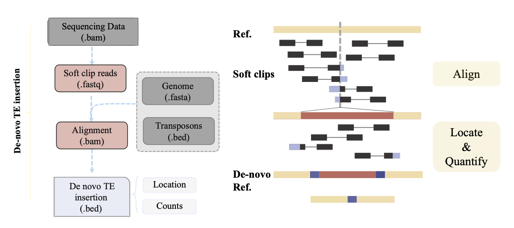

# TEi
[](https://www.gnu.org/licenses/gpl-3.0)

TEi (Transposable element insertion identification) is design to identify TE insertion from paired-end illumina reads, takes whole-exome sequencing (WES), whole-genome sequencing (WGS) and Histone Modification (H3K27ac et al.) data



# Installation
TEi has been successfully installed on Mac OSX, Linux, and Windows, using the devtools package to install directly from GitHub

```r
devtools::install_github("tchen-tt/TEi")
```
# Contribution
Improvements and new features will be added on a regular basis, please post on the github page with any question or if you would like to contribute.

# Contact
Please contact us:  
Tao Chen: <taochenhm@gmail.com>


# Reference
\[1\] Tang Z, Steranka J P, Ma S, et al. Human transposon insertion profiling: Analysis, visualization and identification of somatic LINE-1 insertions in ovarian cancer[J]. Proceedings of the National Academy of Sciences, 2017, 114(5): E733-E740.  
\[2\] Chu C, Borges-Monroy R, Viswanadham V V, et al. Comprehensive identification of transposable element insertions using multiple sequencing technologies[J]. Nature communications, 2021, 12(1): 3836.  
\[3\] Vendrell-Mir P, Barteri F, Merenciano M, et al. A benchmark of transposon insertion detection tools using real data[J]. Mobile DNA, 2019, 10: 1-19.  
\[4\] Riehl K, Riccio C, Miska E A, et al. TransposonUltimate: software for transposon classification, annotation and detection[J]. Nucleic Acids Research, 2022, 50(11): e64-e64.  
\[5\] Stuart T, Eichten S R, Cahn J, et al. Population scale mapping of transposable element diversity reveals links to gene regulation and epigenomic variation[J]. elife, 2016, 5: e20777.  

